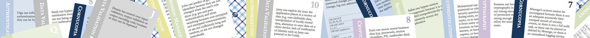
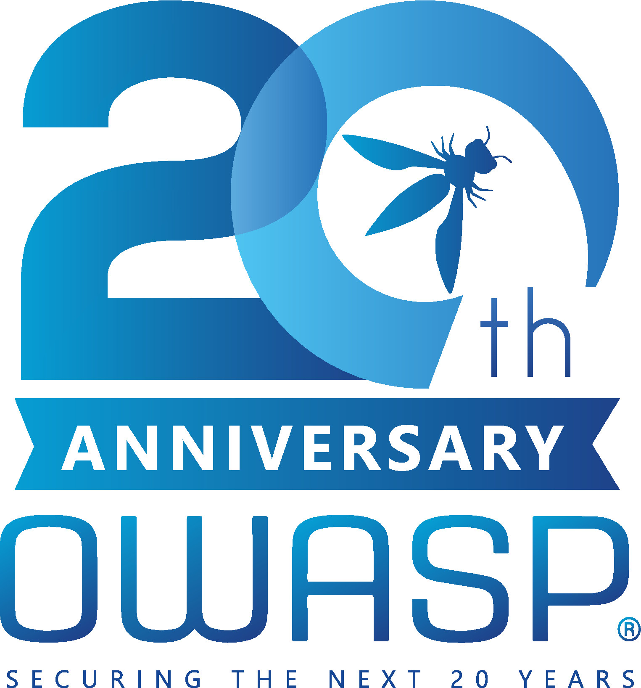

---

layout: col-sidebar
title: OWASP Cornucopia
site_side: true
tags: cc
project: true
level: 3
type: documentation

---

OWASP Cornucopia is a mechanism in the form of a card game to assist software development teams identify security requirements in Agile, conventional and formal development processes. It is language, platform and technology agnostic.

## Introduction
The idea behind Cornucopia is to help development teams, especially those using Agile methodologies, to identify application security requirements and develop security-based user stories. Although the idea had been waiting for enough time to progress it, the final motivation came when [SAFECode](http://www.safecode.org/) published its [Practical Security Stories and Security Tasks for Agile Development Environments](https://safecode.org/publication/SAFECode_Agile_Dev_Security0712.pdf) in July 2012.

The Microsoft SDL team had already published its super [Elevation of Privilege: The Threat Modeling Game](https://www.microsoft.com/en-gb/download/details.aspx?id=20303) (EoP) but that did not seem to address the most appropriate kind of issues that web application development teams mostly have to address. EoP is a great concept and game strategy, and was [published under](https://www.microsoft.com/security/blog/2010/03/02/announcing-elevation-of-privilege-the-threat-modeling-game/) a [Creative Commons Attribution License](http://creativecommons.org/licenses/by/3.0/). Cornucopia Ecommerce Website Edition is based the concepts and game ideas in EoP, but those have been modified to be more relevant to the types of issues ecommerce website developers encounter. It attempts to introduce threat-modelling ideas into development teams that use Agile methodologies, or are more focused on web application weaknesses than other types of software vulnerabilities or are not familiar with STRIDE and DREAD.

To start using Cornucopia:

1. Either: Obtain or buy a pre-printed deck of cards
1. Or: Download the document
   1. Print the cards onto plain paper or pre-scored card
   1. Cut/separate the individual cards
1. Identify an application, module or component to assess
1. Invite business owners, architects, developers, testers along for a card game
1. Get those infosec folk to provide chocolate, pizza, beer, flowers or all four as prizes
1. Select a portion of the deck to start with
1. [Play the game](https://owasp.org/www-project-cornucopia/#div-cards) to discuss & document security requirements (and to win rounds)
1. Remember, points make prizes!

## The Card Decks
### Ecommerce Website Edition

Instead of EoP’s STRIDE suits, Cornucopia suits were selected based on the structure of the OWASP Secure Coding Practices - Quick Reference Guide (SCP), but with additional consideration of sections in the [OWASP Application Security Verification Standard](https://owasp.org/www-project-application-security-verification-standard/), the [OWASP Web Security Testing Guide](https://owasp.org/www-project-web-security-testing-guide) and David Rook's [Principles of Secure Development](https://owasp.org/www-pdf-archive//OWASP-SecureDevPrinciples-David-Rook.pdf). These provided five suits, and a sixth called “Cornucopia” was created for everything else:

* Data validation and encoding
* Authentication
* Session management
* Authorization
* Cryptography
* Cornucopia

Each suit contains 13 cards (Ace, 2-10, Jack, Queen and King) but, unlike EoP, there are also two Joker cards. The content was mainly drawn from the SCP. Full Wiki Deck.

### Other Decks
Future editions such as for mobile app development will use different sources of information and suits.

## Mappings
The other driver for Cornucopia is to link the attacks with requirements and verification techniques. An initial aim had been to reference [CWE](http://cwe.mitre.org/) weakness IDs, but these proved too numerous, and instead it was decided to map each card to [CAPEC](http://capec.mitre.org/) software attack pattern IDs which themselves are mapped to CWEs, so the desired result is achieved.

Each card is also mapped to the 36 primary security stories in the [SAFECode document](https://safecode.org/resource-secure-development-practices/fundamental-practices-secure-software-development-2/), as well as to the OWASP [SCP](https://owasp.org/www-project-secure-coding-practices-quick-reference-guide/) v2, [ASVS](https://owasp.org/www-project-application-security-verification-standard/) v3.0.1 and [AppSensor](https://owasp.org/www-project-appsensor/) (application attack detection and response) to help teams create their own security-related stories for use in Agile processes.

## Licensing

OWASP Cornucopia is free to use. It is licensed under the [Creative Commons Attribution-ShareAlike 3.0 license](http://creativecommons.org/licenses/by-sa/3.0/), so you can copy, distribute and transmit the work, and you can adapt it, and use it commercially, but all provided that you attribute the work and if you alter, transform, or build upon this work, you may distribute the resulting work only under the same or similar licence to this one.

© OWASP Foundation

## Other Security Gamification

If you are interested in using gaming for security, also see [Elevation of Privilege: The Threat Modeling Game](https://www.microsoft.com/en-gb/download/details.aspx?id=20303), [Security Cards](http://securitycards.cs.washington.edu/) from the University of Washington, the commercial card game [Control-Alt-Hack](http://www.controlalthack.com/) ([presentation](http://www.youtube.com/watch?v=Kpnvsgiiz8s)), [OWASP Snakes and Ladders](https://owasp.org/www-project-snakes-and-ladders), and web application security training tools incorporating gamification such as [OWASP Hackademic Challenges Project](https://owasp.org/www-project-hackademic-challenges), [OWASP Security Shepherd](https://owasp.org/www-project-security-shepherd) and [ITSEC Games](http://itsecgames.blogspot.co.uk/).

Additionally, Adam Shostack maintains a list of tabletop security games and related resources at [security games](http://adam.shostack.org/games.html).

## 20th Anniversary Celebrations
The Cornucopia project would like to join other [OWASP Projects and Sponsors](https://20thanniversary.owasp.org/supporters/) is support of the 20th anniversary celebration of the Foundations existance. It's been a fantastic 20 year journey and we look forward to the next 20 years!

