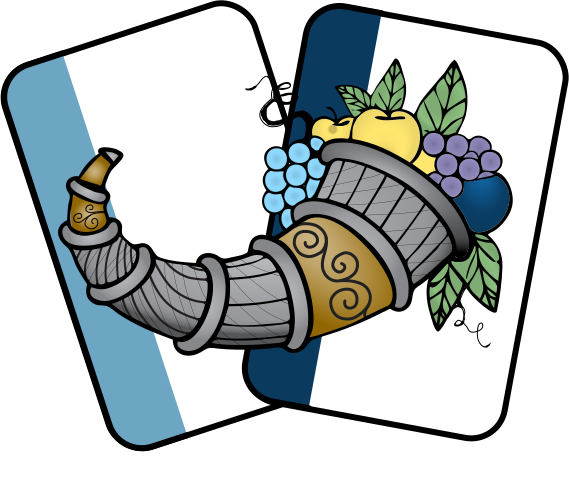
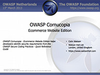
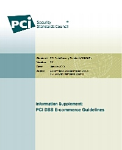

### Quick Links
* How to Play video:
    * [Project Team: v1.00](https://youtu.be/i5Y0akWj31k)
    * [RBI Version: v1.24](https://youtu.be/XXTPXozIHow)
* OWASP Conferences:
    * [OWASP Global AppSec - Lisbon - 2024](https://youtu.be/7ZfJBZBY7Bw)
* Sources and material: 
  * [Scoresheet (website app)](assets/files/Cornucopia-scoresheet.pdf)
  * [Scoresheet (mobile app)](assets/files/cornucopia-scoresheet-mobileapp.pdf)
  * [All sources and downloads...](https://github.com/OWASP/cornucopia)

### What is Cornucopia?
* OWASP Cornucopia is a card game used to help derive application security requirements during the software development life cycle. 
* Listen to the [OWASP 24/7 Podcast](http://trustedsoftwarealliance.com/2014/03/21/the-owasp-cornucopia-project-with-colin-watson/) about Cornucopia.

### Project Information
* <i class="fas fa-city" style="font-size: 1.2em; color:#FFA500;"></i>Production Project
* <i class="fas fa-book" style="font-size: 1.2em; color:#233e81;"></i>Documentation
* <i class="fas fa-tools" style="font-size: 1.2em; color:#233e81;"></i>Builder 
* <i class="fas fa-shield-alt" style="font-size: 1.2em; color:#233e81;"></i>Defender

### Presentation
* 
* The game rules are in the document download. But the OpenOffice [project presentation](assets/files/Owasplondon-colinwatson-cornucopia.odp) includes an animated version of four demonstration rounds. The presentation is recorded [on video](http://youtu.be/Q_LE-8xNXVk).

### PCIDSS

* 
* OWASP Cornucopia Ecommerce Website Edition was referenced in the [Payment Card Industry Security Standards Council](https://www.pcisecuritystandards.org/) information supplement [PCI DSS E-commerce Guidelines v2](https://www.pcisecuritystandards.org/pdfs/PCI_DSS_v2_eCommerce_Guidelines.pdf), January 2013.

### License

* 
