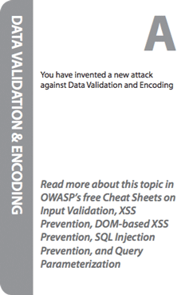

## Acknowledgements

### Volunteers

Cornucopia is developed, maintained, updated and promoted by a worldwide team of volunteers. The contributors to date have been:

* Simon Bennetts
* Thomas Berson
* Tom Brennan
* Fabio Cerullo
* Oana Cornea
* Johanna Curiel
* Todd Dahl
* Luis Enriquez
* Ken Ferris
* Darío De Filippis
* Sebastien Gioria
* Tobias Gondrom
* Timo Goosen
* Anthony Harrison
* Martin Haslinger
* John Herrlin
* Jerry Hoff
* Marios Kourtesis
* Franck Lacosta
* Mathias Lemaire
* Antonis Manaras
* Jim Manico
* Mark Miller
* Cam Morris
* Grant Ongers
* Susana Romaniz
* Ravishankar Sahadevan
* Tao Sauvage
* Max Alejandro Gómez Sánchez Vergaray
* Wagner Voltz
* Stephen de Vries
* Colin Watson

Also:

* Attendees at OWASP London, OWASP Manchester and OWASP Netherlands chapter meetings, the London Gamification meetup, and the training at AppSec USA 2015 in san Francisco who made helpful suggestions and asked challenging questions

### Others

* Microsoft SDL Team for the Elevation of Privilege Threat Modelling Game, published under a Creative Commons Attribution license, as the inspiration for Cornucopia and from which many ideas, especially the game theory, were copied.
* Keith Turpin and contributors to the “OWASP Secure Coding Practices - Quick Reference Guide”, originally donated to OWASP by Boeing, which is used as the primary source of security requirements information to formulate the content of the cards.
* Contributors, supporters, sponsors and volunteers to the OWASP ASVS, AppSensor and Web Framework Security Matrix projects, Mitre’s Common Attack Pattern Enumeration and Classification (CAPEC), and SAFECode’s “Practical Security Stories and Security Tasks for Agile Development Environments” which are all used in the cross-references provided.
* Playgen for providing an illuminating afternoon seminar on task gamification, and tartanmaker.com for the online tool to help create the card back pattern.
* Blackfoot UK Limited for creating and donating print-ready design files, Tom Brennan and the OWASP Foundation for instigating the creation of an OWASP-branded box and leaflet, and OWASP employees, especially Kate Hartmann, for managing the ordering, stocking and despatch of printed card decks.
* Agile Stationary for producing packs for sale contributing to wider awareness of the project
* Oana Cornea and other participants at the AppSec EU 2015 project summit for their help in creating the demonstration video.
* Colin Watson as author and co-project leader with Darío De Filippis, along with other OWASP volunteers who have helped in many ways.
