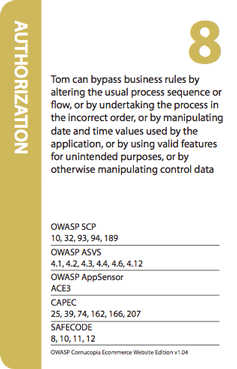
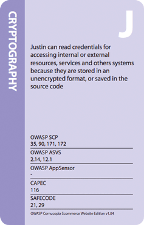

## Frequently Asked Questions

### Can I copy or edit the game?
Yes of course. All OWASP materials are free to do with as you like provided you comply with the Creative Commons Attribution-ShareAlike 3.0 license. Perhaps if you create a new version, you might donate it to the OWASP Cornucopia Project?
### How can I get involved?
Please send ideas or offers of help to the project’s mailing list.
### How were the attackers’ names chosen?
EoP begins every description with words like "An attacker can...". These have to be phrased as an attack but I was not keen on the anonymous terminology, wanting something more engaging, and therefore used personal names. These can be thought of as external or internal people or aliases for computer systems. But instead of just random names, I thought how they might reflect the OWASP community aspect. Therefore, apart from "Alice and Bob", I use the given (first) names of current and recent OWASP employees and Board members (assigned in no order), and then randomly selected the remaining 50 or so names from the current list of paying individual OWASP members. No name was used more than once, and where people had provided two personal names, I dropped one part to try to ensure no-one can be easily identified. Names were not deliberately allocated to any particular attack, defence or requirement. The cultural and gender mix simply reflects theses sources of names, and is not meant to be world-representative.
### Why aren’t there any images on the card faces?
There is quite a lot of text on the cards, and the cross-referencing takes up space too. But it would be great to have additional design elements included. Any volunteers?
### Are the attacks ranked by the number on the card?
Only approximately. The risk will be application and organisation dependent, due to varying security and compliance requirements, so your own severity rating may place the cards in some other order than the numbers on the cards.

### How long does it take to play a round of cards using the full deck?
This depends upon the amount of discussion and how familiar the players are with application security concepts. But perhaps allow 1.5 to 2.0 hours for 4-6 people.
### What sort of people should play the game?
Always try to have a mix of roles who can contribute alternative perspectives. But include someone who has a reasonable knowledge of application vulnerability terminology. Otherwise try to include a mix of architects, developers, testers and a relevant project manager or business owner.
### Who should take notes and record scores?
It is better if that someone else, not playing the game, takes notes about the requirements identified and issues discussed. This could be used as training for a more junior developer, or performed by the project manager. Some organisations have made a recording to review afterwards when the requirements are written up more formally.
### Should we always use the full deck of cards?
No. A smaller deck is quicker to play. Start your first game with only enough cards for two or three rounds. Always consider removing cards that are not appropriate at all of the target application or function being reviewed. For the first few times people play the game it is also usually better to remove the Aces and the two Jokers. It is also usual to play the game without any trumps suit until people are more familiar with the idea.
### What should players do when they have an Ace card that says “invented a new X attack”?
The player can make up any attack they think is valid, but must match the suit of the card e.g. data validation and encoding). With players new to the game, it can be better to remove these to begin with.
### I don’t understand what the attack means on each card - is there more detailed information?
Yes, the Wiki Deck at was created to help players understand the attacks. See Wiki Deck.
### My company wants to print its own version of OWASP Cornucopia - what license do we need to refer to?
What is required/reasonable might depend upon how you propose to use the source Cornucopia material. See fuller answer immediately below.
Some examples of re-using or reproducing Cornucopia are:

1. Print some decks and give them away to customers
1. Reproduce the game exactly but with a corporate-branded package
1. Use the idea and/or source files to produce a similar game but with different attacks/mappings
1. Distribute modified design files

If option 1 above, you can order these in bulk from OWASP and attach your own details below the "compliments of" section on the boxes. There are three aspects to consider for options 2, 3 or 4, or combinations of those - see below. The existing printed decks (and their boxes and leaflets include such text).

#### A - Cornucopia License

The precise wording will depend how the material is being used or reproduced. Under Creative Commons Attribution-ShareAlike 3.0 license it is necessary to attribute all previous contributions (in this case, Microsoft, Boeing, Mitre, etc). The easiest place to put the wording is on the leaflet (folded inside, or separate booklet). The current required long-form wording is:

> OWASP Cornucopia is licensed under the Creative Commons Attribution-ShareAlike 3.0 license http://creativecommons.org/licenses/by-sa/3.0/

> The files used to create these materials were created from the OWASP project and are also open source, and are licensed under the same conditions. 

> OWASP Cornucopia can be downloaded for free from the OWASP website and printed yourself. The OWASP Cornucopia project source in vendor neutral and unbranded.

> OWASP does not endorse or recommend commercial products or services.

> © 2012-2018 OWASP Foundation

> This document is licensed under the Creative Commons Attribution-ShareAlike 3.0 license.

> Acknowledgments:

> Microsoft SDL Team for the Elevation of Privilege Threat Modelling Game, published under a Creative Commons Attribution license, as the inspiration for Cornucopia and from which many ideas, especially the game theory, were copied.

> Keith Turpin and contributors to the “OWASP Secure Coding Practices - Quick Reference Guide”, originally donated to OWASP by Boeing, which is used as the primary source of security requirements information to formulate the content of the cards.

> Contributors, supporters, sponsors and volunteers to the OWASP ASVS, AppSensor and Web Framework Security Matrix projects, Mitre’s Common Attack Pattern Enumeration and Classification (CAPEC), and SAFECode’s “Practical Security Stories and Security Tasks for Agile Development Environments” which are all used in the cross-references provided.

> Playgen for providing an illuminating afternoon seminar on task gamification, and tartanmaker.com for the online tool to help create the card back pattern.

> Blackfoot UK Limited for creating and donating print-ready design files, Tom Brennan and the OWASP Foundation for instigating the creation of an OWASP-branded box and leaflet, and OWASP employees, especially Kate Hartmann, for managing the ordering, stocking and despatch of printed card decks.

> Oana Cornea and other participants at the AppSec EU 2015 project summit for their help in creating the demonstration video.

> Colin Watson as author and co-project leader with Darío De Filippis, along with other OWASP volunteers who have helped in many ways.

The box/container for the cards must have the wording:

> Created by Colin Watson.

> Contains: One pack of Cornucopia Ecommerce Website playing cards. OWASP Cornucopia is open source and can be downloaded free of charge from the OWASP website.

> OWASP Cornucopia is free to use. It is licensed under the Creative Commons Attribution-ShareAlike 3.0 license, so you can copy, distribute and transmit the work, and you can adapt it, and use it commercially, but all provided that you attribute the work and if you alter, transform, or build upon this work, you may distribute the resulting work only under the same or similar license to this one.
 
The following short-form wording must also appear on any materials referencing the outputs (e.g. press releases, leaflets, reports, blog posts):

> OWASP does not endorse or recommend commercial products or services.

> OWASP Cornucopia is licensed under the Creative Commons Attribution-ShareAlike 3.0 license and is © 2012-2016 OWASP Foundation.

If any files are distributed electronically, the long-form wording should also be aded in a license.txt file within the distribution.

If the intention is to use the idea only (option 3 above), the long-form, box and short-form wording might be different, and probably simpler. And it might make more sense to start with the Microsoft-provided Elevation of Privilege files (and open source license).

#### B - Upcoming update to Cornucopia

Note that the current print design files are v1.04, and the current Word document is v1.10, but we are in the process of updating all of these to v1.20.

Whatever is used as a starting point, please state the source version, for example:

> Based on OWASP Cornucopia Ecommerce Website Edition v1.04

#### C - OWASP brand usage

Additionally individuals, companies and other organisations must not breach OWASP's brand usage guidelines.

> [https://www.owasp.org/www-policy/operational/branding.html](/www-policy/operational/branding.html)
 
In the case of Cornucopia, in 2014 Blackfoot Limited produced some printed decks of cards. Blackfoot's name and logo did not appear anywhere on the OWASP-branded cards, and the OWASP logo did not appear on the Blackfoot-branded box and leaflet. In fact there is no OWASP logo on any part of the Blackfoot branded decks.
