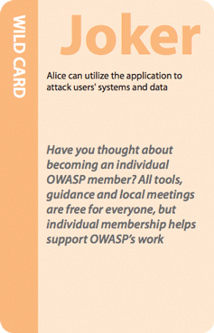

## Road Map

### v2.x

Below is a preliminary summary of our wishes, dreams and aspirations for Cornucopia. If you have suggestions, ideas, please feel free to discuss them on our [email list](https://groups.google.com/a/owasp.org/g/cornucopia-project) or submit them to our [list of issues](https://github.com/OWASP/cornucopia/issues) in our repository. 
If you feel like and have the oportunity to help with any of the issues below, do not hesitate to get in touch.

Ordered alphabeticly and not according to priority.

- Build the requirement map on the card using OpenCRE for easier maintainence and collaboration. [cornucopia #595](https://github.com/OWASP/cornucopia/issues/595)
- Endpoint per card with more information available on copi. [copi #6](https://github.com/secure-delivery/copi/issues/6)
- Ensure the converter can create print-ready proofs for print-on-demand jobs. 
- Include QR codes on the Cornucopia cards. [cornucopia #382](https://github.com/OWASP/cornucopia/issues/382)
- Language review of the existing translations. [cornucopia #596](https://github.com/OWASP/cornucopia/issues/596)
- Migrate the wiki deck to github wiki. [cornucopia #1](https://github.com/OWASP/www-project-cornucopia/issues/1)
- Seek worldwide translators and incorporate additional translations for other languages.

## Getting Involved

Involvement in the development and promotion of Cornucopia is actively encouraged! You do not have to be a security expert in order to contribute. Some of the ways you can help are listed below.

### Localization

Are you fluent in another language? Can you help translate Cornucopia into that language? Note this is a very large task due to the number of documents involved, but the strings are now all available in textual data files.

### Use and Promote the Cornucopia Card Decks

Please help raise awareness of Cornucopia by:
* Printing dcks of cards and giving them away
* Using Cornucopia with specifiers, architects, designers, developers, testers and others, in part to train them, but also to solicit feedback on their usability, practicality and appropriateness for their work
* Creating videos about how to play the game
* Developing a mobile app to play the game

### Feedback

Please use the friendly project [Google Group](https://groups.google.com/a/owasp.org/forum/#!forum/cornucopia-project) for feedback:

* What do like?
* What don't you like?
* What cards don't make sense?
* How could the guidance be improved?
* What other decks would you like to see?

### Keep the Cards Updated

As the source referenced documents change, we have to update the decks. You may also find errors and omissions. In the first instance, please send a message to the project's [Google Group](https://groups.google.com/a/owasp.org/forum/#!forum/cornucopia-project) if you have identified errors & omissions, have some time to maintain the source documents, or can help in other ways.

### Create a New Deck

The first deck, Cornucopia Ecommerce Website Edition, has been renamed Cornucopia Website App Edition and is currently available in six languages. There is also a mobile app specific deck called Cornucopia Mobile App Edition available in English only. Do you have an idea for your own application security requirements card deck? 
